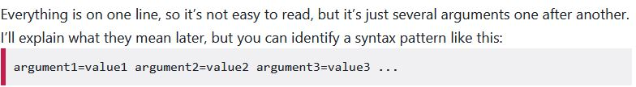

# piBareMetalLisp

piBareMetalLisp(Raspberry pi Bare metal Lisp) is a toy lisp interpreter based on [Circle](https://github.com/rsta2/circle),[circle-stdlib](https://github.com/smuehlst/circle-stdlib) and [microlisp](https://github.com/lazear/microlisp):now it's only use circle-stdlib's IO function as the lisp REPL.The effect on my "rpi4b-notebook":

 

## Build
you have to make circle and circle-stdlib well(you can test the samples,especially [circle-stdlib sample2 02-stdio-hello](https://github.com/smuehlst/circle-stdlib/tree/master/samples/02-stdio-hello)).If everything is fine,copy or clone the project under the circle-stdlib's sample folder(to use the makefile and environment) ,first "make clean" to delete useless files(like kernel8-rpi4.map,kernel.d,main.d),then make.The kernel8-rpi4.img is the result(I think you can use the kernel8-rpi4.img of the project already build directly,you may rename it to kernel8.img)

## Install

I have only run the img under rpi4b.I don't know if it can run on other rpi model(if it can,the img file name should be change)

### 1 copy the img file and other files

you should replace the img file of rpi4 of your sd card.I found these ways:

1. Make an sd card using rust-rpi-os's install guide:

https://github.com/rust-embedded/rust-raspberrypi-OS-tutorials/tree/master/05_drivers_gpio_uart#rpi-4

this method seems need fewer file to start rpi4b with kernel8.img

2. Make an sd card using circle's install guide:

https://github.com/rsta2/circle?tab=readme-ov-file#installation

3. Using a offical rpi4's os sd card,then replace (backup the orginal first) the img file

### 2 prepare the config.txt and cmdline.txt file

copy(or edit the options) the config.txt and cmdline.txt on the sd card's top floder(you can also use them under this project's configFile folder).

Be carefull ! :

the config.txt option are seperated line by line:
https://www.raspberrypi.com/documentation/computers/config_txt.html

but cmdline.txt option are seperated by space:

https://raspberrytips.com/raspberry-pi-cmdline-txt/



you maybe want to use the US keymap,then add the option

    keymap=US

is in cmdline.txt(the default keymap of circle and circle-stdlib seems is DE).There are six keymap options can set:

https://github.com/rsta2/circle/blob/master/sample/08-usbkeyboard/README

And it seems the option 

    width=640 height=480

make the text look bigger,I suggest to add this option

## IDE config

I use vscode and vscode wsl plugin to edit the code.If vscode report it can't find the .h file(It seems if clone circle-stdlib project use root,the vscode report no error,but if not root,vscode will report can't find .h file),you may need to edit the vscode c/c++ plugin's "Include path" option by enter "Ctrl+Shift+p"(change ... to your absolute path):

```
/.../circle-stdlib/include
/.../circle-stdlib/libs/circle-newlib/newlib/libc/include
/.../circle-stdlib/libs/circle/include
/.../circle-stdlib/libs/circle/addon
```

## Changes I make to let microlisp run on rpi4b bare metal with circle-stdlib

There is two edition of microlisp:[scheme](https://github.com/lazear/microlisp/tree/master/scheme) and [scheme-gc](https://github.com/lazear/microlisp/tree/master/scheme-gc),I just copy the scheme code(it seems easier) to circle-stdlib kernel.cpp,fix some error that vscode (with WSL's vscode plugin) report:

1. the microlisp defined macro TRUE and FALSE,but circle&circle-stdlib defined them too in types.h,so I rename them to TRUEE and FALSEE

2. microlisp use c and circle&circle-stdlib use c++,so I add casting of every malloc

3. add function my_strdup replace the use of strdup in function make_symbol in kernel.cpp,it seems vscode can't find the right strdup function

4. in this lisp on rpi4,some microlisp's buildin function like exit() obvious can't use now (I need to change function exit to poweroff later)

then change the main function:

    CStdlibApp::TShutdownMode CKernel::Run (void)

bing! it worked(lucky)

## TODO list

Here is the plan of future:

- [ ] try to create some file-system function,like (ls)
(try to wrap the circle-stdlib's file opreation function)

- [ ] now the interpreter can only eval the single line expression,it's better there is a smallest editor that can edit the lisp code,so I can write more lines of lisp code,and save/reload it.The editor better look like the classic QBasic's IDE

- [ ] fix the microlisp's bug,and make it faster:

Now microlisp seems lake of error handle:the expression

    (map (lambda(x)(+ x 1)) '(1 2 3))

works,but if missing the bracket:

    (map (lambda(x)(+ x 1) '(1 2 3))

there is no error report on screen(in original microlisp either)

some tiny lisp interpreter like [Mal](https://github.com/kanaka/mal)'s c edition can show the error message

and the microlisp seems read the expression from stdin every single char,better to make it faster

- [ ] The lisp interpreter itself can manage the memery,need to learn the detail,and let the lisp's memery manage way to be the OS's memery manage way

- [ ] It's better be a chess and a go game,start it using (chess) and (go)

- [ ] There is other rpi4b function,like opengl,may be can try them.


